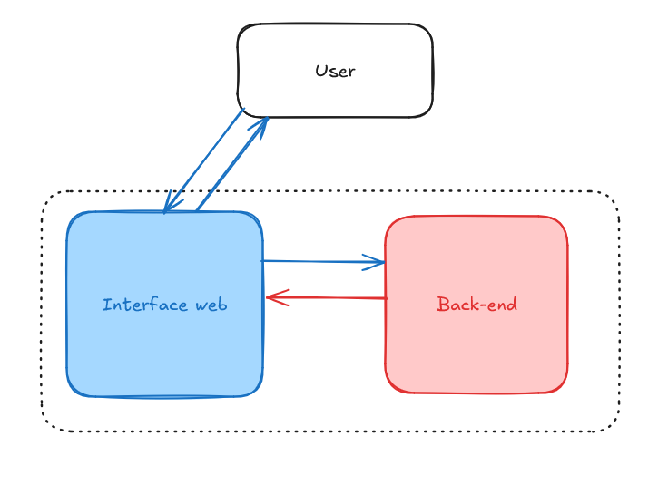
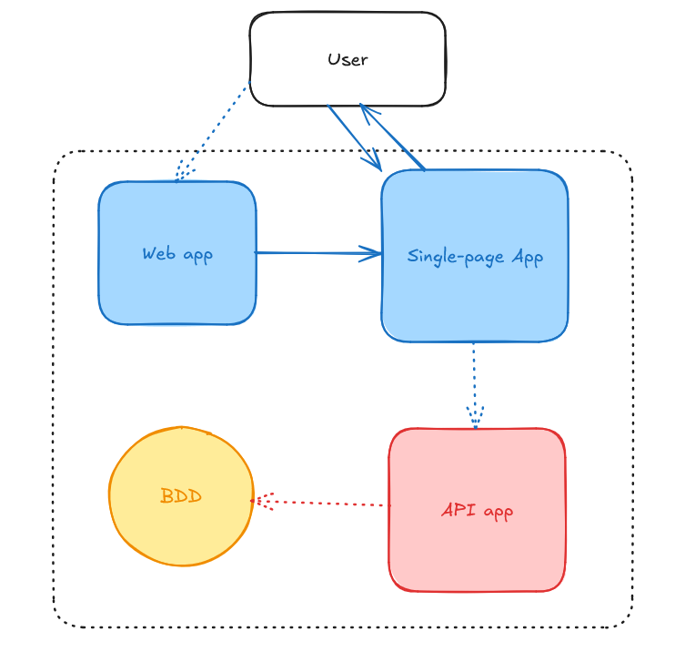
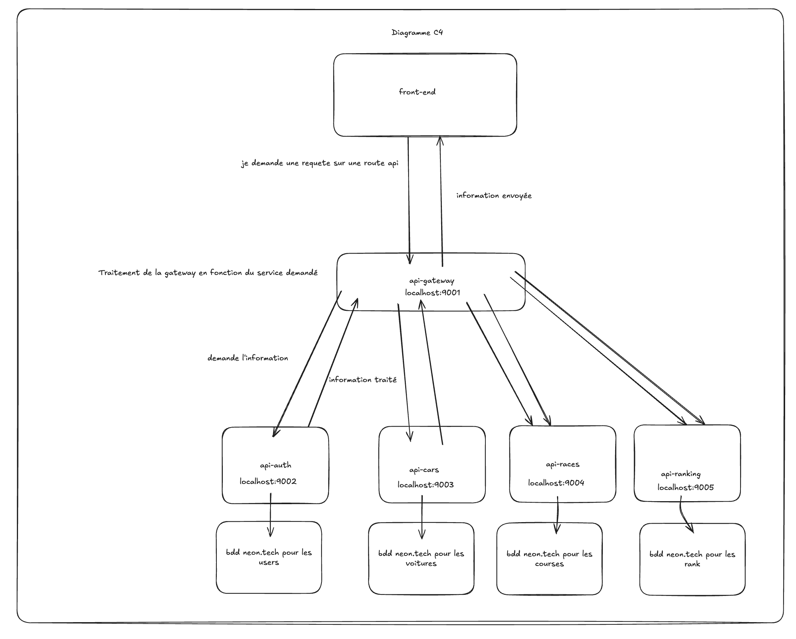
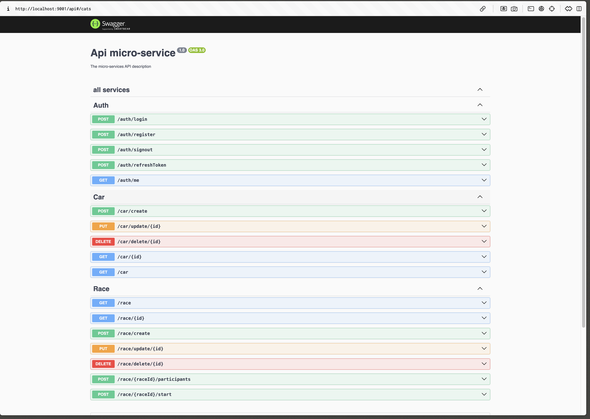

# Projet d'architecture Logicielle (micro-services)

## Introduction

Ce projet est une application web qui permet de gérer les données d'un archi-logique.

## Installation

Pour installer le projet, il faut d'abord cloner le dépôt git et ensuite exécuter les commandes suivantes :

(faire cette commande sur le nombre de services disponibles)
```bash
cd {{api-service-directory}}
npm install
npm run start
```

## Diagramme C4




## Swagger API

run the gateway api with the following command :

```bash
cd api-gateway
npm run start
```

Then, you can access the swagger api at the following url :

http://localhost:9001/api



## tests : 
rendez-vous sur l'api gateway pour lancer les tests

```bash
npm run test:e2e
```

# Patterns utilisés


## All Paterns use

quelques exemlpes de patterns utilisés dans le projet: 

@Decorator
```
@UseInterceptors(LoggingInterceptor)
@Controller('users')
export class UserController {
  constructor(private readonly userService: UserService) {}

  @Get(':id')
  findOne(@Param('id') id: string) {
    return this.userService.findOne(id);
  }
}
```

Pattern Observable
```
canActivate(
    context: ExecutionContext,
  ): boolean | Promise<boolean> | Observable<boolean> {
    const request = context.switchToHttp().getRequest();

    if (!request.headers || !request.headers.authorization) {
      throw new UnauthorizedException('Authorization header is missing');
    }

    return this.client
      .send('VERIFY_TOKEN', {
        headers: request.headers,
      })
      .pipe(
        tap((res) => {
          request.user = res;
        }),
        map(() => true),
        catchError(() => of(false)),
      );
  }
```
permets d'attendre une réponse qui vérifiera si le token est valide ou non.

On est pas sur de savoir lister tous les patterns utilisés dans le projet.
Car Nestjs en utilise beaucoup.


# Pourquoi utiliser Nestjs

Nestjs est un framework pour développer des applications web en Node.js.
Il est basé sur TypeScript et utilise une architecture modulaire.
Il est conçu pour être facile à utiliser et à maintenir.
Il est également très performant et permet de développer des applications web scalables.

Pour ce projet, Nestjs est particulièrement adapté car il permet de développer des microservices via un package npm.
et de façon tres simple.

```
npm i --save @nestjs/microservices
```

# Explications fonctionnelles 

## Création d'un utilisateur 

On peut créer un utilisateur avec un nom un prénom un email et un mot de passe et son age.

## Création d'une voiture

Une fois connecté on peut créer une voiture avec la marque et le modèle et sa couleur ainsi qu'une image.

## Création d'une course

Une fois connecté encore une fois on peut créer une course avec son nom, sa date et sa localisation.

## Inscription a une course

On peut inscrire un véhicule a une course avec son identifiant et la course ne peut se lancer que si il y a 2 véhicule dans celle-ci.


## Impossible a run si nous n'avez pas les .env :) à demander à moi :)
